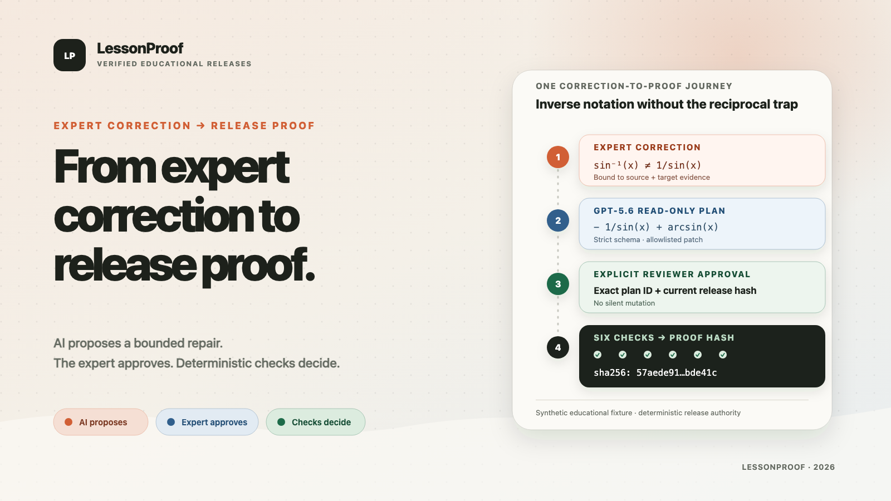
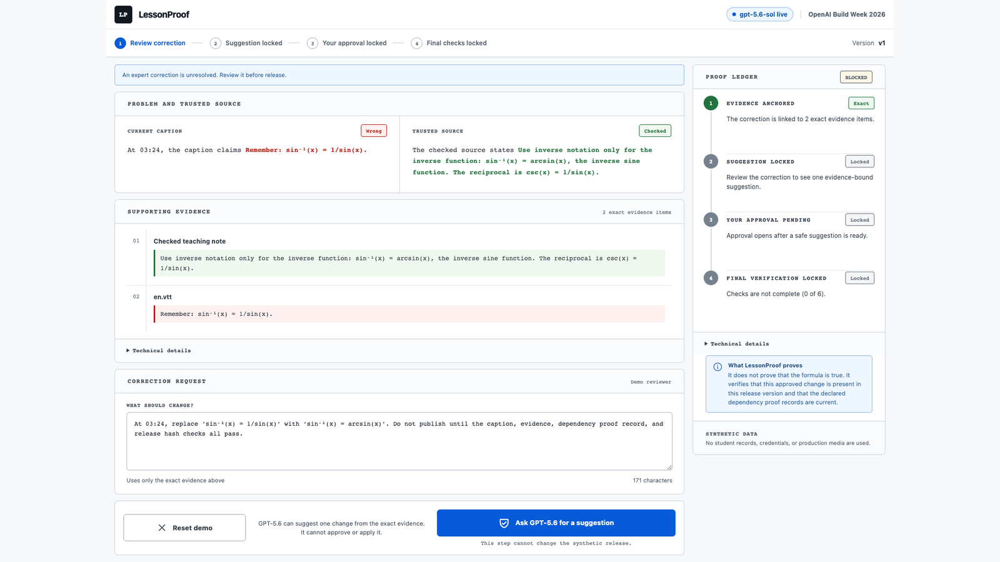
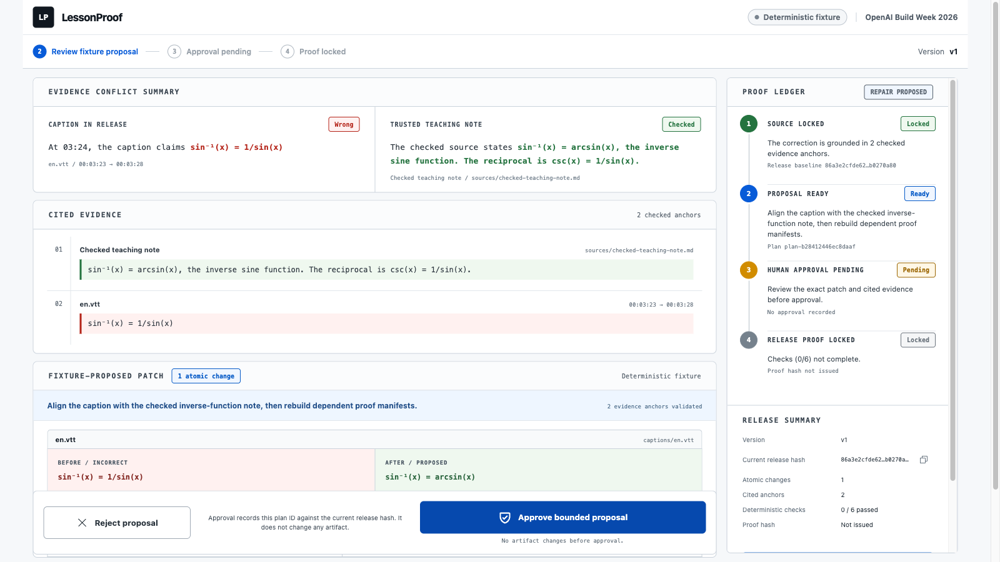
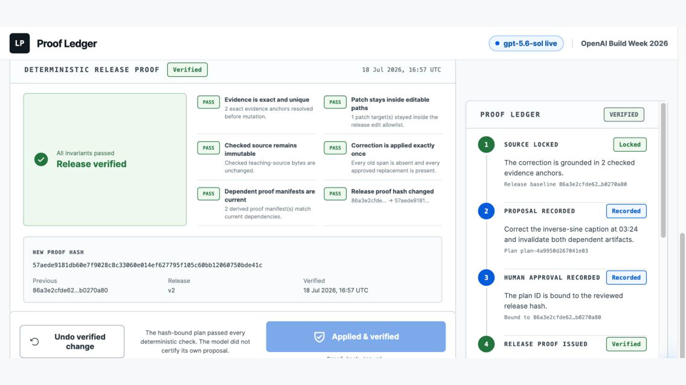

# LessonProof

**GPT-5.6 proposes. A human approves. Deterministic checks decide.**



One wrong sentence in a lesson is easy to correct. The real release risk is
shipping while dependency proof records still describe an older version.

LessonProof is a release pipeline for educational content. GPT-5.6 proposes a
bounded repair from cited evidence. A human reviews the exact diff.
Deterministic checks—not the model—decide whether the updated release can ship.

**[Try the live judge build](https://lessonproof.onrender.com)** — no account,
API key, or setup required.

This standalone OpenAI Build Week 2026 Education entry was created during the
competition period. It uses a synthetic lesson so the complete experience is
safe to inspect, run, and record without student data or private source
material.

## Why it matters

Educational content rarely exists as one sentence in one file. A correction
may affect the explanation, caption, claim, and release package. This prototype
updates its synthetic caption record and recomputes two declared dependency
proof records; it does not rewrite real media or linked production files.

Many education AI products focus on generating or grading content. LessonProof
starts when a human expert says the AI is wrong and converts that correction
into a source-bound, testable release contract.

The bundled demonstration begins with a deliberately false caption:
`sin⁻¹(x) = 1/sin(x)`. The checked teaching note establishes that
`sin⁻¹(x) = arcsin(x)`, while the reciprocal of sine is cosecant.

## The workflow

1. The expert records a correction against the current release hash.
2. GPT-5.6 interprets the correction against bounded source and target
   evidence and returns a strict structured repair proposal.
3. LessonProof resolves exact evidence quotes, enforces the editable-path
   allowlist, verifies dependency invalidation, and rejects stale or unsafe
   plans.
4. The expert reviews and approves the exact patch. Approval does not mutate
   the release.
5. LessonProof applies the approved patch, recomputes two dependency proof
   records, and runs six deterministic checks.
6. A fully passing release receives a new SHA-256 proof hash. Undo is permitted
   only while that exact verified state is still current.

The verified result states the outcome directly:
`1 caption fixed. 2 dependency proofs recomputed. 6 of 6 checks passed.`

GPT-5.6 proposes. A human approves. Deterministic code decides whether the
release can ship.

## Run it locally

Requirements: Node.js 20.19 or newer.

```bash
npm ci
npm run dev
```

Open <http://localhost:5173>. The default built-in demo requires no account,
network connection, or secret and exercises the same validated plan
schema and approval/apply/undo state machine as live mode.

Run the complete verification suite:

```bash
npm run check
```

The suite currently covers 41 tests across the domain engine (15), GPT-5.6
planner adapter (7), HTTP API and session boundary (11), interface (3), and
snapshot adapter (3), plus interface design guards (2). The same command also runs TypeScript validation, a
production build, and public package checks.

For the exact judge path and production commands, see
[docs/testing.md](docs/testing.md).

## Live GPT-5.6 mode

The API key stays server-side and outside Git.

```bash
cp .env.example .env
# Set OPENAI_API_KEY in .env.
LESSONPROOF_PLANNER_MODE=openai npm run dev
```

Run the bounded provider smoke before recording a live-model claim:

```bash
npm run smoke:openai
```

Live mode calls the OpenAI Responses API with `gpt-5.6-sol`, medium reasoning,
`store: false`, a privacy-preserving `safety_identifier`, and a strict JSON
Schema. Model output is untrusted input: the same domain validator, human
approval, deterministic checks, and hash guards apply in both planner modes.
If inference fails, refuses, times out, identifies the wrong model family, or
returns an invalid plan, the release remains unchanged.

The included Render blueprint deploys this live path with the API key held in
the host secret manager. It limits anonymous traffic to two analyses per
browser session, 100 analyses per 30-day process window, and one concurrent
analysis; an external OpenAI project budget remains the final spending guard.

## How Codex and GPT-5.6 were used

I retained the key product decisions:

- one synthetic golden path that a judge can understand in minutes;
- GPT-5.6 as a read-only planner rather than a release authority;
- an exact reviewable diff and explicit human approval before mutation;
- deterministic code, not model confidence, as the release gate;
- a clean-room boundary around prior experience and private data.

I used Codex to turn those boundaries into a strict state machine, split the
engine, API, interface, and test suite into parallel work, probe stale-hash and
cross-session failures, run the complete verification loop, and redesign the
first interface around the current Proof Ledger. Codex accelerated the
implementation and review; I remained responsible for the product boundary and
every release claim.

At runtime, GPT-5.6 turns the reviewer's correction and bounded evidence into a
schema-constrained proposal: which exact quote to change, which anchors support
it, and which dependent artifacts to invalidate. LessonProof treats that plan
as untrusted input and owns every permission, validation, mutation, check,
proof, and undo decision around it.

## Safety and judgeability

- Synthetic educational content only; no student identity or private course
  material is required.
- One isolated in-memory workflow per browser, carried by an opaque,
  HTTP-only, same-site cookie.
- Same-origin mutation checks, bounded request bodies, and a 2,000-character
  correction limit.
- Per-session, global, and concurrency limits around live model analysis.
- Strict model-output schema plus domain validation of evidence, paths,
  patches, affected artifacts, and check closure.
- Optimistic release hashes prevent stale planning, approval, apply, and undo.
- The visibly labeled `Built-in demo · no AI call` path gives judges a complete
  no-secret test route without impersonating a provider response.

This prototype modifies only its disposable in-memory synthetic release and
does not edit real media or linked production files. It is not a
learning-management system, autonomous publisher, or certification of
educational truth.

## Submission gallery

| Initial release gate | Bounded repair proposal | Verified release |
|---|---|---|
| [](submission/assets/screenshots/01-initial-blocked.png) | [](submission/assets/screenshots/02-repair-proposed.png) | [](submission/assets/screenshots/03-release-verified.png) |

These images document the preceding deployed interface and are temporarily
stale relative to the latest local wording. They must be recaptured after the
new interface is deployed and must not be used as the final submission gallery
until then. The replacement proposal capture must visibly say
`Built-in demo · no AI call`. See the
[architecture visual](submission/assets/architecture.png) and
[asset provenance notes](submission/assets/README-assets.md).

## Documentation

- [Architecture and trust boundaries](docs/architecture.md)
- [Provenance and qualifying work](docs/provenance.md)
- [Feature-to-evidence traceability](docs/traceability.md)
- [Judge testing guide](docs/testing.md)
- [Before Build Week](BEFORE.md)
- [Build Week result](AFTER.md)
- [Security policy](SECURITY.md)

## License

MIT. See [LICENSE](LICENSE).
