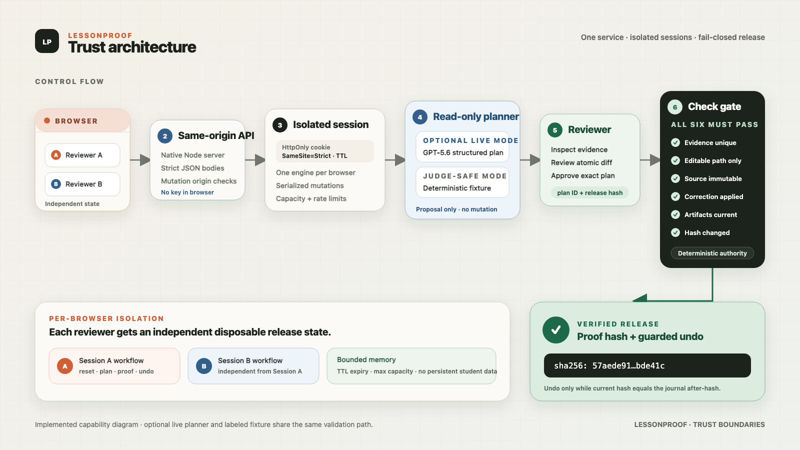
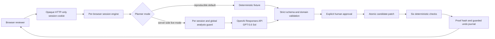

# Architecture and trust boundaries

LessonProof is one same-origin web service around a narrow state machine.
GPT-5.6 interprets a correction; it never owns mutation, validation, approval,
verification, or publication.





## Responsibility split

| Layer | Can do | Cannot do |
|---|---|---|
| GPT-5.6 planner | Interpret the correction, cite exact evidence, propose bounded patches, identify affected artifacts, request checks | Read arbitrary files, mutate state, approve, run checks, issue proof, or publish |
| Plan validator | Enforce strict shape, exact unique quotes, document roles, safe paths, patch binding, dependency closure, and the complete check set | Infer educational truth without checked evidence |
| Human reviewer | Approve one exact plan ID against one current release hash | Bypass post-apply checks or expand the patch |
| Deterministic engine | Apply the approved candidate, rebuild dependent proof manifests, run invariants, calculate hashes, and journal before/after state | Invent a new correction or broaden model scope |
| Browser UI | Expose evidence, diff, affected artifacts, checks, state, hashes, errors, and controls | Hold an API key or silently mutate release data |
| Session layer | Isolate browser workflows, serialize mutations, expire idle state, and derive a privacy-preserving safety identifier | Persist student data or share one judge's workflow with another |
| Analysis guard | Bound live requests per browser, globally, and concurrently | Validate model semantics or authorize a release |

## Per-browser runtime boundary

The first workflow request creates a random 32-byte browser session ID. It is
stored only in an `HttpOnly`, `SameSite=Strict` cookie, with `Secure` enabled in
production. The server creates one in-memory engine per session and rejects a
second mutation while that session already has an action in flight.

Default bounds are:

- one-hour idle session TTL;
- 500 in-memory sessions per process, evicting least-recent state at capacity;
- four live analyses per browser per hour;
- fifty live analyses per process per hour;
- two concurrent live analyses.

All values are deployment-configurable. Fixture analysis does not consume the
live-model request allowance.

The OpenAI `safety_identifier` is a one-way SHA-256-derived value with a product
prefix. The raw browser cookie is never sent to the model provider.

## Release state machine

```text
BLOCKED baseline with an unresolved expert correction
  -> analyze a valid correction against current hash
REPAIR_PROPOSED
  -> approve exact plan ID + current release hash
APPROVED
  -> apply candidate + all six checks pass
READY with applied journal (rendered as VERIFIED)
  -> undo only when current hash == journal afterHash
BLOCKED with the original correction unresolved
```

Ambiguous evidence, prompt-like unsafe instructions, unsupported paths,
malformed output, incomplete dependency invalidation, stale hashes, unapproved
apply, failed invariants, concurrent mutation, or an invalid undo fails closed.

## Six release checks

1. Evidence resolves exactly once.
2. Every patch stays inside editable paths.
3. Checked source bytes remain immutable.
4. The approved correction is applied exactly once.
5. Dependent proof manifests match current dependencies.
6. The release proof hash changes.

The candidate release becomes current only when all six pass.

## GPT-5.6 request contract

Live mode calls `POST /v1/responses` server-side with:

- model `gpt-5.6-sol` by default;
- `reasoning.effort: medium`;
- `store: false`;
- `text.verbosity: low`;
- a strict JSON Schema under `text.format`;
- a privacy-preserving `safety_identifier`;
- bounded synthetic documents, correction, dependency graph, current release
  hash, and required check IDs;
- instructions that treat documents and corrections as untrusted data;
- a 45-second provider timeout and 2,500 output-token ceiling.

The response must report a completed GPT-5.6-family model, contain no refusal,
satisfy the application Zod schema, and pass the domain validator. A valid JSON
shape alone is never sufficient to change a release.

## API surface

| Method | Route | Purpose |
|---|---|---|
| `GET` | `/api/health` | Service, planner mode, model, and configuration-presence health |
| `GET` | `/api/demo` | Current browser's synthetic workflow snapshot |
| `POST` | `/api/analyze` | Correction plus optimistic release hash |
| `POST` | `/api/approve` | Exact plan ID plus current release hash |
| `POST` | `/api/apply` | Apply only the approved current plan |
| `POST` | `/api/undo` | Journal ID plus expected current proof hash |
| `POST` | `/api/demo/reset` | Reset only the current browser's disposable fixture |

Successful workflow routes return a typed session snapshot. Errors use the
stable `{ error: { code, message, details } }` envelope; live-limit responses
also include `Retry-After`.
